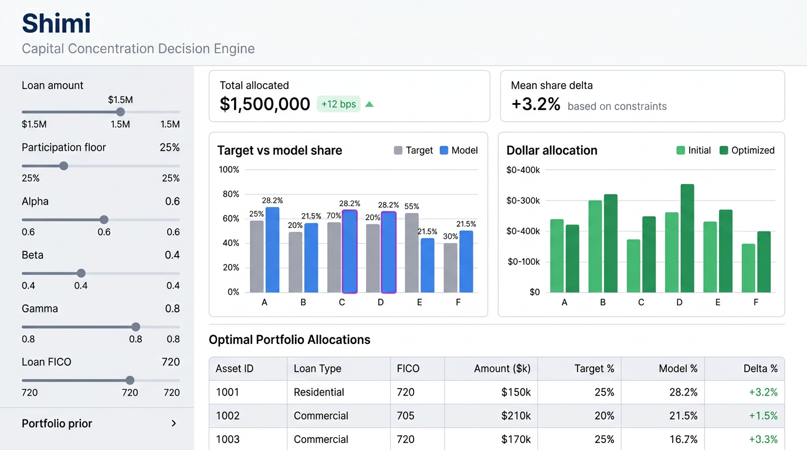

# Shimi

Capital Concentration Decision Engine — 資本密度意思決定エンジン — Shimi

## Simulation workspace (UI)

The Streamlit app uses a **wide two-column layout**: parameters on the left, live solver output (metrics, charts, tables) on the right. Below is an **illustrative mockup** of that feedback loop—not a pixel-perfect capture of your machine; run the app locally for the real UI.



## Layout

```
Shimi/
├── app/
│   └── shimi_app.py       # Main Streamlit app
├── shimi/                 # Core package (data, allocation, metrics)
│   ├── data/              # Lender program & allocation history
│   ├── allocation/        # Per-loan QP (CVXPY + OSQP)
│   └── metrics/           # Gini, FICO-weighted face, cumulative funded / remaining from history
├── data/
│   ├── sample_lenders.csv        # Lender book snapshot
│   ├── sample_loans.csv          # Loan tape (loan_fico + face per lender)
│   ├── sample_allocation_history.csv  # Optional replay into book (demo history / remaining)
│   ├── sample_portfolio_prior.csv # Cumulative Σface & Σ(face×FICO) per lender
│   └── README.md                 # Describes the sample files
├── docs/
│   ├── images/            # README UI mockup (replace with your own screenshot if you prefer)
│   ├── spec/              # Requirements, architecture, glossary
│   └── notes/             # Draft / scratch markdown
├── tests/                 # Pytest
├── notebooks/
│   └── prototype.ipynb    # Initial experimentation
├── pyproject.toml         # Package metadata (pip install -e .)
├── requirements.txt
├── README.md
├── .gitignore
└── LICENSE
```

## Documentation

**Specification** ([docs/spec/](docs/spec/)): authoritative product and technical intent for Shimi. Update these when scope or design changes; link to them from pull requests when behavior is spec-driven.

| Document | Purpose |
|----------|---------|
| [requirements.md](docs/spec/requirements.md) | Goals, users, constraints, acceptance criteria |
| [architecture.md](docs/spec/architecture.md) | Components, data flow, dependencies, key decisions |
| [glossary.md](docs/spec/glossary.md) | Domain terms and definitions |

Scratch notes and drafts live in [docs/notes/](docs/notes/).

Sample CSVs under [data/](data/) are described in [data/README.md](data/README.md): lender book, loan tape (one `loan_fico` per row), and optional portfolio priors for γ. Use `load_loan_tape_from_csv`, `load_portfolio_prior_from_csv`, and `portfolio_prior_from_loan_tape` from `shimi.data`.

## How loan allocation works (for stakeholders)

Shimi treats each new loan as a **splitting problem**: how much of this loan should each lender take, right now, given how much capacity they still have and how we want the program to behave?

### 1. Non‑negotiable rules (constraints)

Before we talk about “preferences,” the model enforces the guardrails you would insist on in a committee room:

- **The pieces must add up.** The sum allocated equals the full loan amount—no accidental over- or under-allocation.
- **Nobody is asked to fund more than they have left.** Each lender’s slice is capped by their **remaining commitment** for the program.
- **Everyone can stay meaningfully in the deal (when you want that).** You can set a **participation floor**—for example, each lender must take at least 5% of the loan—so the program does not produce lots of trivial “sliver” participations unless you choose to allow them.

If those rules cannot all be satisfied at once (for example, the loan is larger than the group’s remaining capacity, or the floor is too high), Shimi **says so up front** instead of producing a misleading split.

### 2. Business priorities (what we optimize)

Once the feasible region is clear, we need a principled way to choose *which* feasible split to use. Spreadsheets often hide trade-offs in manual tweaks. Here we make the trade-offs explicit and **tunable**:

- **Stay near fair, agreed targets.** Each lender has a **target share** (for example, reflecting their share of total commitments). We penalize moving away from that split. The weight **α (alpha)** controls how strongly we insist on staying close to those targets—higher α means “stick to the agreed risk distribution.”
- **Protect contractual originators.** For lenders flagged as **contractual originators**, we add a penalty when this loan would **use a large fraction of their remaining line** in one go. The weight **β (beta)** controls how cautious we are about drawing down their capacity relative to others—higher β means “ease off the originators when the math allows.”
- **Fair dealing on credit quality (FICO), aggregate over time.** With **γ (gamma)** we are *not* “punishing weaker lenders.” Everyone uses the **same risk assumptions**; **each loan has one representative FICO**, and over a sequence of loans those scores can look **roughly bell-shaped (Gaussian)** in the aggregate. What we care about for fairness is **each lender’s portfolio**: the **weighted average FICO of everything they have funded so far** (using that loan-level score each time). The goal is for those **portfolio averages to stay roughly the same across lenders** as loans roll on. In the engine, when you supply **cumulative prior funded face** and **cumulative Σ(face × loan FICO)** per lender, γ penalizes imbalances in how this new loan moves everyone toward a **common** portfolio average. If you have **no** history yet (cold start), γ falls back to nudging toward **equal shares** on the current loan as a simple proxy. You still trade all of this off against commitment-based targets (α) and originator protection (β).

You do not need to pick a single “magic” allocation by hand. You **turn the dials** (α, β, γ, floor, loan size, loan FICO, and optional cumulative portfolio inputs) and see how the recommended split responds—similar in spirit to a stress-testing dashboard, but grounded in a single transparent optimization.

### 3. Why use an optimizer at all?

This is a **small constrained decision problem** solved many times as you explore scenarios. A **quadratic program** (QP) is a standard, well-understood formulation: “choose the split that **minimizes weighted squared gaps** from what we want, subject to linear rules.” In practice that means:

- **Stable, intuitive behavior** when you move sliders—no wild jumps from tiny input changes.
- **Fast answers** suitable for an interactive tool (milliseconds per loan on a laptop).
- **Reproducibility**—the same inputs yield the same allocation, which supports audit and review.
- **Separation of concerns**—policy lives in the weights and floors; the solver’s job is only to find the best feasible split.

Under the hood we use **CVXPY** with the **OSQP** solver—mature, open-source building blocks—so the approach is not a one-off script but something you could extend, test, and eventually wire to richer data as the program grows.

### 4. What this demo is (and is not)

Shimi here is a **simulation and transparency layer**: it shows how a disciplined, constraint-first allocation behaves under different priorities. It is **not** claiming to replace legal documentation, credit committees, or production treasury systems—but it **does** demonstrate that a stakeholder-friendly, auditable allocation workflow can sit on top of clear rules and transparent tuning.

## Technical primer: the per-loan model

A compact mathematical picture of what `shimi.allocation` implements—useful if you are comfortable with vectors, basic optimization, and want to connect the code to equations.

### Problem setup

**Decision variables:** shares $s \in \mathbb{R}^n$, where $s_i$ is lender $i$’s fraction of the current loan. Dollar amounts follow $x_i = L\,s_i$ for loan face $L > 0$.

**Constraints (all linear in $s$):**

- **Full allocation:** $\displaystyle\sum_{i=1}^n s_i = 1$.
- **Capacity:** $\displaystyle s_i \le \frac{r_i}{L}$ where $r_i$ is remaining commitment.
- **Participation floor:** $s_i \ge f_{\mathrm{floor}}$ for all $i$ (e.g. $f_{\mathrm{floor}} = 0.05$).

The feasible set is an intersection of an affine hyperplane and axis-aligned bounds—a **polytope**. If it is empty (e.g. floors too high, or aggregate remaining $< L$), the problem is **infeasible**.

**Symbols:** $f_{\mathrm{floor}}$ is the participation floor (minimum share per lender). $f_{\mathrm{loan}}$ is this loan’s representative FICO used in Term C—distinct from $f_{\mathrm{floor}}$.

### Objective

We minimize a **sum of nonnegative weighted squared terms** in $s$. Scalars $\alpha$, $\beta$, $\gamma$, and $\mathrm{ridge}$ set how strongly each preference matters.

**Term A — $\alpha$ (target mix):**

$$\alpha \,\lVert s - t \rVert^2 = \alpha \sum_i (s_i - t_i)^2$$

where $t_i$ are **target shares** (e.g. from commitment mix). Expanding gives terms in $s_i^2$ and $s_i$—**quadratic** in $s$.

**Term B — $\beta$ (contractual originator utilization):**

$$\beta \sum_{i \in \mathrm{CO}} \left(\frac{L s_i}{r_i}\right)^2$$

For lenders flagged as **contractual originators** (CO), penalize squared **utilization** of remaining line. Each summand is proportional to $s_i^2$—again **quadratic**. If $\beta = 0$ or there are **no** CO lenders, this term is omitted (nothing to penalize).

**Term C — $\gamma$ (FICO / fair dealing):**

One loan-level representative FICO $f_{\mathrm{loan}}$ (same meaning as `loan_fico` in code). **Cold start** (no useful cumulative prior): $\gamma \,(f_{\mathrm{loan}}/850)^2\, \lVert s - u \rVert^2$ with $u_i = 1/n$ and $850$ as a fixed scale constant. **With portfolio prior:** let $A_i$, $F_i$ be **funded face** and **FICO-weighted face** ($\sum \text{face} \times \text{FICO}$) for lender $i$ before this loan, $\mu = (\sum_i F_i) / (\sum_i A_i)$ the **group** weighted-average FICO before the loan, and $x_i = L s_i$. The objective uses a sum of squares of $(F_i - \mu A_i) + x_i(f_{\mathrm{loan}} - \mu)$ in $s$ (**scaled in code for numerics**)—again quadratic in $s$. **Implementation note:** if $f_{\mathrm{loan}} \approx \mu$ (within a small tolerance), the portfolio branch does not apply that scaled term and the engine uses the **cold-start** equal-share $\gamma$ form instead.

**Ridge:** $\mathrm{ridge}\,\lVert s\rVert^2$ for well-posedness and numerics.

**Standard form:** The whole objective can be written as

$$\min_{s} \quad \tfrac{1}{2} s^\top P s + q^\top s + c$$

with $P \succeq 0$ (positive semidefinite), because it is a sum of squares with nonnegative weights—a **convex quadratic** function of $s$.

### Why quadratic programming (QP), not linear programming (LP)?

- **Linear programming (LP)** minimizes a **linear** objective $c^\top s$ subject to linear constraints.
- **Quadratic programming (QP)** minimizes a **convex quadratic** $\tfrac{1}{2}s^\top P s + q^\top s$ subject to **linear** constraints.

Here the **constraints** are linear in $s$, but the **objective** contains **squares of the decision variables** (and squares of affine functions of $s$). That is exactly **QP**. If the objective were only linear in $s$, the same feasible set would define an **LP**—but then you could not express least-squares-style trade-offs (target fit, squared utilization, etc.) without changing the problem class.

**Convexity:** With $P \succeq 0$, any local minimum is **global** (same structural family as constrained least squares; KKT conditions apply).

### Solver stack

**CVXPY** builds the problem; **OSQP** solves **convex QPs** with linear equalities and inequalities efficiently. Policy lives in $(\alpha,\beta,\gamma,f_{\mathrm{floor}},\mathrm{ridge},\ldots)$ plus optional cumulative priors and $f_{\mathrm{loan}}$; the solver returns the best feasible $s$.

## Setup

```bash
python -m venv .venv
.venv\Scripts\activate   # Windows
pip install -r requirements.txt
pip install -e .         # makes the `shimi` package importable for Streamlit & tests
```

## Run the app

```bash
streamlit run app/shimi_app.py
```

## Tests

```bash
pytest
```

## License

See [LICENSE](LICENSE).
