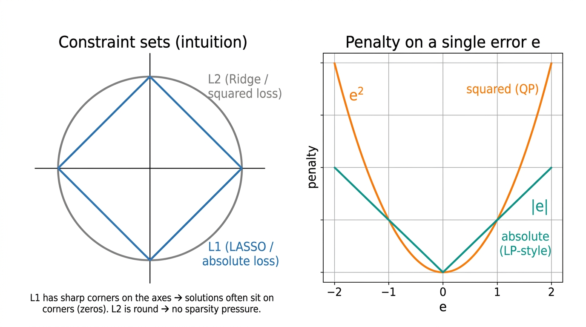

# Shimi

Capital Concentration Decision Engine — 資本密度意思決定エンジン — Shimi

## Simulation workspace (UI)

The Streamlit app uses a **wide two-column layout**: parameters on the left, live solver output (metrics, charts, tables) on the right. Below is an **illustrative mockup** of that feedback loop—not a pixel-perfect capture of your machine; run the app locally for the real UI.


## Layout

```
Shimi/
├── app/
│   └── shimi_app.py       # Main Streamlit app
├── shimi/                 # Core package (data, allocation, metrics)
│   ├── data/              # Lender program & allocation history
│   ├── allocation/        # Per-loan QP (CVXPY + OSQP)
│   └── metrics/           # Gini, FICO-weighted face, cumulative funded / remaining from history
├── data/
│   ├── sample_lenders.csv        # Lender book snapshot
│   ├── sample_loans.csv          # Loan tape (loan_fico + face per lender)
│   ├── sample_allocation_history.csv  # Optional replay into book (demo history / remaining)
│   ├── sample_portfolio_prior.csv # Cumulative Σface & Σ(face×FICO) per lender
│   └── README.md                 # Describes the sample files
├── docs/
│   ├── images/            # README figures (UI mockup, QP/LP primer diagram)
│   ├── spec/              # Requirements, architecture, glossary
│   └── notes/             # Draft / scratch markdown
├── tests/                 # Pytest
├── notebooks/
│   └── prototype.ipynb    # Initial experimentation
├── pyproject.toml         # Package metadata (pip install -e .)
├── requirements.txt
├── README.md
├── .gitignore
└── LICENSE
```

## Documentation

**Specification** ([docs/spec/](docs/spec/)): authoritative product and technical intent for Shimi. Update these when scope or design changes; link to them from pull requests when behavior is spec-driven.

| Document | Purpose |
|----------|---------|
| [requirements.md](docs/spec/requirements.md) | Goals, users, constraints, acceptance criteria |
| [architecture.md](docs/spec/architecture.md) | Components, data flow, dependencies, key decisions |
| [glossary.md](docs/spec/glossary.md) | Domain terms and definitions |

Scratch notes and drafts live in [docs/notes/](docs/notes/).

Sample CSVs under [data/](data/) are described in [data/README.md](data/README.md): lender book, loan tape (one `loan_fico` per row), and optional portfolio priors for γ. Use `load_loan_tape_from_csv`, `load_portfolio_prior_from_csv`, and `portfolio_prior_from_loan_tape` from `shimi.data`.

## How loan allocation works (business · software)

**Who this section is for:** **Business readers**—committee-style rules, tunable priorities, and what the UI is demonstrating. **Software engineers**—behavioral expectations, integration surface, and where the heavy math lives (the [Technical primer](#technical-primer-per-loan-model-mathematical-specification) below is the precise spec).

Shimi treats each new loan as a **splitting problem**: how much of this loan should each lender take, right now, given how much capacity they still have and how we want the program to behave?

### 1. Non‑negotiable rules (constraints)

Before we talk about “preferences,” the model enforces the guardrails you would insist on in a committee room:

- **The pieces must add up.** The sum allocated equals the full loan amount—no accidental over- or under-allocation.
- **Nobody is asked to fund more than they have left.** Each lender’s slice is capped by their **remaining commitment** for the program.
- **Everyone can stay meaningfully in the deal (when you want that).** You can set a **participation floor**—for example, each lender must take at least 5% of the loan—so the program does not produce lots of trivial “sliver” participations unless you choose to allow them.

If those rules cannot all be satisfied at once (for example, the loan is larger than the group’s remaining capacity, or the floor is too high), Shimi **says so up front** instead of producing a misleading split.

### 2. Business priorities (what we optimize)

Once the feasible region is clear, we need a principled way to choose *which* feasible split to use. Spreadsheets often hide trade-offs in manual tweaks. Here we make the trade-offs explicit and **tunable**:

- **Stay near fair, agreed targets.** Each lender has a **target share** (for example, reflecting their share of total commitments). We penalize moving away from that split. The weight **α (alpha)** controls how strongly we insist on staying close to those targets—higher α means “stick to the agreed risk distribution.”
- **Protect contractual originators.** For lenders flagged as **contractual originators**, we add a penalty when this loan would **use a large fraction of their remaining line** in one go. The weight **β (beta)** controls how cautious we are about drawing down their capacity relative to others—higher β means “ease off the originators when the math allows.”
- **Fair dealing on credit quality (FICO), aggregate over time.** With **γ (gamma)** we are *not* “punishing weaker lenders.” Everyone uses the **same risk assumptions**; **each loan has one representative FICO**, and over a sequence of loans those scores can look **roughly bell-shaped (Gaussian)** in the aggregate. What we care about for fairness is **each lender’s portfolio**: the **weighted average FICO of everything they have funded so far** (using that loan-level score each time). The goal is for those **portfolio averages to stay roughly the same across lenders** as loans roll on. In the engine, when you supply **cumulative prior funded face** and **cumulative Σ(face × loan FICO)** per lender, γ penalizes imbalances in how this new loan moves everyone toward a **common** portfolio average. If you have **no** history yet (cold start), γ falls back to nudging toward **equal shares** on the current loan as a simple proxy. You still trade all of this off against commitment-based targets (α) and originator protection (β).

You do not need to pick a single “magic” allocation by hand. You **turn the dials** (α, β, γ, floor, loan size, loan FICO, and optional cumulative portfolio inputs) and see how the recommended split responds—similar in spirit to a stress-testing dashboard, but grounded in a single transparent optimization.

### 3. Why use an optimizer at all?

This is a **small constrained decision problem** solved many times as you explore scenarios. Conceptually: among all splits that satisfy the guardrails, pick the one that **best matches** the tunable priorities—implemented as minimizing **weighted squared penalties** when the split drifts from targets, utilization goals, and (optionally) fairness-to-date on FICO. That choice of **squares** (not absolute differences) keeps the behavior **smooth** when you move sliders: large misses cost disproportionately more than small ones, so you do not get brittle corner-chasing.

**What you get in practice**

- **Stable, intuitive behavior** when you move sliders—no wild jumps from tiny input changes.
- **Fast answers** suitable for an interactive tool (milliseconds per loan on a laptop).
- **Reproducibility**—the same inputs yield the same allocation, which supports audit and review.
- **Separation of concerns**—policy lives in the weights and floors; the solver’s job is only to find the best feasible split.

**Software engineering view.** The allocation core is a single convex optimization per loan: **linear constraints** (sum to one, capacity, floor) plus a **convex quadratic objective**—a standard **quadratic program (QP)** family, solved with **CVXPY** and **OSQP** in `shimi.allocation`. Entry point: `allocate_loan` (program snapshot, loan amount, `AllocationParams`, optional `loan_fico` and `PortfolioPrior`). Outputs are **shares and dollar amounts per lender**; the Streamlit app is a thin layer over that API. **QP vs LP**, **Ridge vs LASSO**, standard matrix form, and convexity are spelled out only in the technical primer—so this section stays readable without optimization coursework.

### 4. What this demo is (and is not)

Shimi here is a **simulation and transparency layer**: it shows how a disciplined, constraint-first allocation behaves under different priorities. It is **not** claiming to replace legal documentation, credit committees, or production treasury systems—but it **does** demonstrate that a stakeholder-friendly, auditable allocation workflow can sit on top of clear rules and transparent tuning.

## Technical primer: per-loan model (mathematical specification)

**Audience and scope.** This section is the **mathematical specification** of `shimi.allocation`: notation, feasible set, objective as a sum of convex quadratics, classification as a **convex QP**, contrast with **LP**, and the **Ridge vs LASSO** regularization choice. It is written for readers comfortable with **finite-dimensional convex optimization** (linear constraints, quadratic objectives, positive semidefinite matrices).

### Notation and feasible set

**Decision variables.** Shares $s \in \mathbb{R}^n$, where $s_i$ is lender $i$’s fraction of the current loan. Dollar amounts are $x_i = L\,s_i$ for loan face $L > 0$.

**Linear constraints** (defining the closed convex **polytope** $\mathcal{F} \subset \mathbb{R}^n$):

$$\mathcal{F} = \{\, s \in \mathbb{R}^n \mid \mathbf{1}^\top s = 1,\quad f_{\mathrm{floor}} \le s_i \le \frac{r_i}{L}\quad \forall i \,\}.$$

Here $r_i$ is remaining commitment for lender $i$, and $f_{\mathrm{floor}} \in [0,1/n]$ is the participation floor (e.g. $0.05$). If $\mathcal{F} = \emptyset$ (e.g. floors too high, or aggregate remaining capacity $< L$), the problem is **infeasible**.

**Symbols.** $f_{\mathrm{floor}}$ is the participation floor. $f_{\mathrm{loan}}$ is this loan’s representative FICO in Term C (same as `loan_fico` in code)—distinct from $f_{\mathrm{floor}}$.

### Objective

**Assumption (convex regime).** Take $\alpha, \beta, \gamma, \mathrm{ridge} \ge 0$ (weights; any may be zero so terms vanish). The code accepts arbitrary floats, but **negative** weights would **break** convexity of $f$. Under this assumption, $f$ is a **finite sum of weighted squared Euclidean norms of affine functions of $s$**, hence a **convex quadratic** on $\mathbb{R}^n$.

**Term A — $\alpha$ (target mix).** Target shares $t \in \mathbb{R}^n$ (e.g. from commitment mix), $\mathbf{1}^\top t = 1$:

$$f_A(s) = \alpha \,\lVert s - t \rVert_2^2 = \alpha \sum_{i=1}^n (s_i - t_i)^2.$$

**Term B — $\beta$ (contractual originator utilization).** Let $\mathrm{CO} \subseteq \{1,\ldots,n\}$ be indices of contractual originators. For $i \in \mathrm{CO}$, define line utilization $z_i(s) = L s_i / r_i$. Then

$$f_B(s) = \beta \sum_{i \in \mathrm{CO}} z_i(s)^2.$$

If $\beta = 0$ or $\mathrm{CO} = \emptyset$, $f_B \equiv 0$.

**Term C — $\gamma$ (FICO / fair dealing).** Let $f_{\mathrm{loan}}$ be the loan’s representative FICO (`loan_fico`).

- **Cold start** (no useful cumulative prior in code): with $u = \frac{1}{n}\mathbf{1}$ and fixed scale $850$,

  $$f_C(s) = \gamma \left(\frac{f_{\mathrm{loan}}}{850}\right)^2 \lVert s - u \rVert_2^2.$$

- **Portfolio prior:** let $A_i$ be cumulative funded face and $F_i$ cumulative $\sum(\text{face}\times\text{FICO})$ for lender $i$ before this loan; $\mu = (\sum_i F_i)/(\sum_i A_i)$ provided $\sum_i A_i > 0$; $x_i = L s_i$. With $c_i = F_i - \mu A_i$ and $d = f_{\mathrm{loan}} - \mu$, the code minimizes a **scaled** sum of squares of $c_i + x_i d$ (affine in $s$). If $|d|$ is below a numerical tolerance, the implementation omits this branch and uses the cold-start form above.

**Ridge (Tikhonov on $s$).**

$$f_R(s) = \mathrm{ridge}\,\lVert s \rVert_2^2.$$

If all of $f_A,f_B,f_C,f_R$ vanish, the code adds a tiny default quadratic to keep the problem well-posed.

**Aggregate objective and standard QP form.** Let $f(s) = f_A(s) + f_B(s) + f_C(s) + f_R(s)$. Then $f$ can be written as

$$f(s) = \tfrac{1}{2} s^\top P s + q^\top s + c$$

for some symmetric $P \in \mathbb{R}^{n \times n}$ with **$P \succeq 0$**: each summand $\|A s + b\|_2^2 = s^\top A^\top A s + 2 b^\top A s + b^\top b$ has $A^\top A \succeq 0$, and a nonnegative weighted sum of PSD matrices is PSD. Constants $q,c$ depend on $(t,L,r,\ldots)$ but not on $s$.

**Per-loan problem (convex QP).**

$$\begin{aligned}
\min_{s \in \mathcal{F}} \quad & \tfrac{1}{2} s^\top P s + q^\top s
\end{aligned}$$

(The additive constant $c$ is omitted—it does not affect the argmin.) With $P \succeq 0$ and nonempty polyhedral $\mathcal{F}$, this is a **convex quadratic program**. For convex quadratic minimization over a polyhedron, **Karush–Kuhn–Tucker (KKT)** conditions are **necessary and sufficient** for a point to be a **global** minimizer.

*Remark (degenerate objective).* If $P = 0$ (all weights zero), the objective is linear on $\mathcal{F}$; the implementation still adds a small $\varepsilon \|s\|_2^2$ term ($\varepsilon = 10^{-6}$ in code) so the Hessian is positive definite and the QP is strictly convex.

### QP vs LP and Ridge vs LASSO (design trade-offs)

The feasible set $\mathcal{F}$ is **polyhedral** (linear equalities and inequalities). The **objective** determines the problem class: **squared** vs **absolute** losses, and **$\ell_2$** (Ridge) vs **$\ell_1$** (LASSO-style) structure where sparsity is desired—see below.



**Definitions.** A **linear program (LP)** is $\min_{s \in \mathcal{G}} \, c^\top s$ with $\mathcal{G}$ a polyhedron. A **(convex) quadratic program (QP)** is $\min_{s \in \mathcal{G}} \, \tfrac{1}{2} s^\top P s + q^\top s$ with $P \succeq 0$ and $\mathcal{G}$ a polyhedron.

**QP vs LP.** Terms A–C and Ridge are sums of weighted **squares** of **affine** maps of $s$, so $f$ is **convex quadratic**; with $s \in \mathcal{F}$ this is a **QP**. Replacing those **squares** by **absolute values** (introducing slack variables so the objective and constraints stay linear) yields an **LP** in standard form; the **$\ell_1$** geometry typically favors **vertices** and **sparse** active sets. We retain **$\ell_2^2$** losses for a **smooth**, **differentiable** (in the interior) objective and **OSQP**-friendly structure.

**Ridge vs LASSO.** **Ridge** adds $\mathrm{ridge}\,\|s\|_2^2$: **$\ell_2$** shrinkage, **no** exact zeros at finite penalty. **LASSO** in regression penalizes **$\|\beta\|_1$** to obtain **sparsity** in $\beta$ (many $\beta_j = 0$) via the **nondifferentiable** $\ell_1$ norm and **low-dimensional faces** of the $\ell_1$ ball. *Remark:* On the simplex $\{s \ge 0 : \mathbf{1}^\top s = 1\}$, $\|s\|_1 = 1$ identically, so an **$\ell_1$ penalty on $s$ alone** does not behave like regression LASSO; the relevant point is that **$\ell_1$-style objectives elsewhere** (e.g. on **deviations** or in unconstrained weight vectors) encode **feature selection**, which is **misaligned** with **broad lender participation** and **target-based** fairness. Hence **$\ell_2^2$** Ridge, not **$\ell_1$** sparsity, in this design.

### Solver stack

**CVXPY** expresses the problem; **OSQP** solves the **convex QP**. Policy lives in $(\alpha,\beta,\gamma,f_{\mathrm{floor}},\mathrm{ridge},\ldots)$ plus optional cumulative priors and $f_{\mathrm{loan}}$; the solver returns the best feasible $s$.

## Setup

```bash
python -m venv .venv
.venv\Scripts\activate   # Windows
pip install -r requirements.txt
pip install -e .         # makes the `shimi` package importable for Streamlit & tests
```

## Run the app

```bash
streamlit run app/shimi_app.py
```

## Tests

```bash
pytest
```

## License

See [LICENSE](LICENSE).
